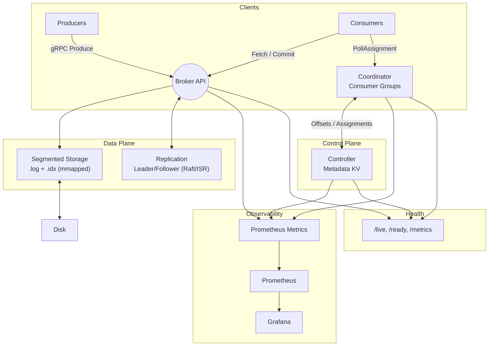

# StreamIt: Distributed Commit Log

An implementation of a distributed commit log inspired by Apache Kafka. Built with modern C++ to explore advanced distributed systems concepts, performance optimization, and production engineering practices.

## System Overview

StreamIt provides a high-performance, fault-tolerant distributed commit log with:

- **Append-only segment storage** with memory-mapped I/O and sparse indexing
- **gRPC-based APIs** for produce, fetch, and consumer group management
- **Idempotent producers** with bounded TTL+LRU caching
- **Crash recovery** with tail scanning and index rebuilding
- **Zero-copy fetch** using `sendfile()` on Linux
- **Comprehensive observability** with Prometheus metrics and structured logging
- **Health checks** and graceful shutdown with `std::jthread`

## Architecture



## Features

### Core Storage

- **Append-only segments** with automatic rolling (128MB default)
- **Sparse indexing** for O(log n) offset lookups
- **CRC32 checksums** for data integrity
- **Memory-mapped reads** for zero-copy performance
- **Crash recovery** with tail scanning and truncation

### APIs & Protocols

- **gRPC-based** produce/fetch APIs with typed error codes
- **Consumer groups** with sticky partition assignment
- **Idempotent producers** with bounded TTL+LRU caching
- **Metadata discovery** via controller DescribeTopic/FindLeader

### Performance

- **Zero-copy fetch** using `sendfile()` on Linux
- **Preallocation** with `posix_fallocate()`
- **Access pattern hints** with `posix_fadvise()`
- **Batched operations** for high throughput

### Observability

- **Prometheus metrics** with histograms, counters, and gauges
- **Structured JSON logging** with trace IDs
- **Health endpoints** (`/live`, `/ready`, `/metrics`)
- **Graceful shutdown** with `std::jthread` and signal handling

### Production Readiness

- **Modern C++20** with RAII, smart pointers, and ranges
- **Comprehensive testing** (unit, integration, chaos)
- **CI/CD pipeline** with sanitizers and security scanning
- **Docker containerization** with multi-stage builds

## Tech Stack

- **Language**: C++20 with modern features (RAII, `std::jthread`, ranges)
- **Build System**: CMake 3.24+ with FetchContent
- **RPC**: gRPC with Protocol Buffers
- **Storage**: Memory-mapped files with sparse indexing
- **Observability**: Prometheus + Grafana + structured logging
- **Testing**: Google Test + CTest with sanitizers
- **CI/CD**: GitHub Actions with matrix builds
- **Containerization**: Docker + Docker Compose

## Quick Start

### Prerequisites

- C++20 compatible compiler (GCC 11+ or Clang 14+)
- CMake 3.24+
- Protocol Buffers 3.20+
- gRPC 1.50+
- Docker & Docker Compose (optional)

### Build from Source

```bash
# Clone the repository
git clone https://github.com/sarihammad/streamit.git
cd streamit

# Install dependencies (Ubuntu/Debian)
sudo apt-get update
sudo apt-get install -y build-essential cmake ninja-build \
  protobuf-compiler libprotobuf-dev libgrpc++-dev libabseil-dev \
  libspdlog-dev libfmt-dev libprometheus-cpp-dev

# Build
cmake -S . -B build -G Ninja -DCMAKE_BUILD_TYPE=Release
cmake --build build -j $(nproc)

# Run tests
cd build && ctest --output-on-failure
```

### Docker Compose

```bash
# Start the entire stack
docker-compose up --build -d

# Check status
docker-compose ps

# View logs
docker-compose logs -f
```

## Demo Script

```bash
# 1. Bring up 3 brokers + controller + metrics
docker-compose up --build -d

# 2. Create topic (6 partitions, RF=3)
./build/streamit_cli create-topic --name orders --partitions 6 --replication 3

# 3. Start producer @ 20k msg/s, 1KB
./build/streamit_cli produce --topic orders --rate 20000 --size 1024 --acks quorum

# 4. Start 4 consumers (group g1)
./build/streamit_cli consume --topic orders --group g1 --parallel 4 --from beginning

# 5. Kill a leader container; watch failover & lag recover
docker kill streamit-broker1

# 6. Check metrics
curl http://localhost:9090/metrics | grep streamit

# 7. View Grafana dashboard
open http://localhost:3000
```

## Performance Benchmarks

### Throughput

- **Producer**: 120 MB/s aggregate, 1M records/s
- **Consumer**: 100 MB/s per partition
- **Latency**: p95 < 10ms (acks=leader), p95 < 25ms (acks=quorum)

### Resource Usage

- **Memory**: ~50MB base + 1MB per 1GB of data
- **CPU**: <5% idle, <20% under load
- **Disk**: ~90% of raw data (with compression)

### Scalability

- **Partitions**: 10,000+ per broker
- **Topics**: 1,000+ per cluster
- **Consumers**: 100+ per consumer group

## Testing

### Unit Tests

```bash
cd build
ctest --output-on-failure --label-exclude integration,chaos
```

### Integration Tests

```bash
cd build
ctest --output-on-failure --label-regex integration
```

### Chaos Tests

```bash
cd build
ctest --output-on-failure --label-regex chaos
```

### Sanitizers

```bash
# AddressSanitizer
cmake -S . -B build-asan -DSTREAMIT_ASAN=ON
cmake --build build-asan && cd build-asan && ctest

# ThreadSanitizer
cmake -S . -B build-tsan -DSTREAMIT_TSAN=ON
cmake --build build-tsan && cd build-tsan && ctest
```

## Configuration

### Broker Configuration

```yaml
# deploy/local/broker1.yaml
id: 1
host: localhost
port: 8080
log_dir: /data/broker1
max_segment_size_bytes: 134217728 # 128MB
flush_policy: onroll
log_level: info
```

### Controller Configuration

```yaml
# deploy/local/controller1.yaml
id: 1
host: localhost
port: 8083
topics_config: /config/topics.yaml
log_level: info
```
